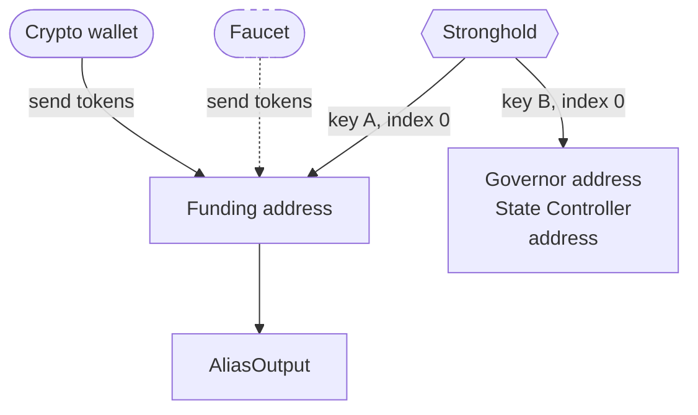

# Producing IOTA DIDs

## Flowchart

### Description

#### Creation

1. Stronghold generates an Ed25519 keypair.
2. Stronghold generates a funding address deterministically.
3. Stronghold generates a `Governor` address deterministically from another key.
4. queries tangle for existing alias outputs for that governor.
5. if none, `DID Manager` produces an `AliasOutput` containing the DID document and determines the cost for storage deposit.
6. User sends tokens to funding address.
7. Funding address pays for storage deposit and instantly returns the remaining tokens to the user's address.
8. DID Manager published the AliasOutput.

#### Destruction

1. DID Manager destroys the Alias Outputs and sends the remaining tokens back to the funding address.
2. New DID can be created or tokens send to another address or returned to same initial address of the user.
